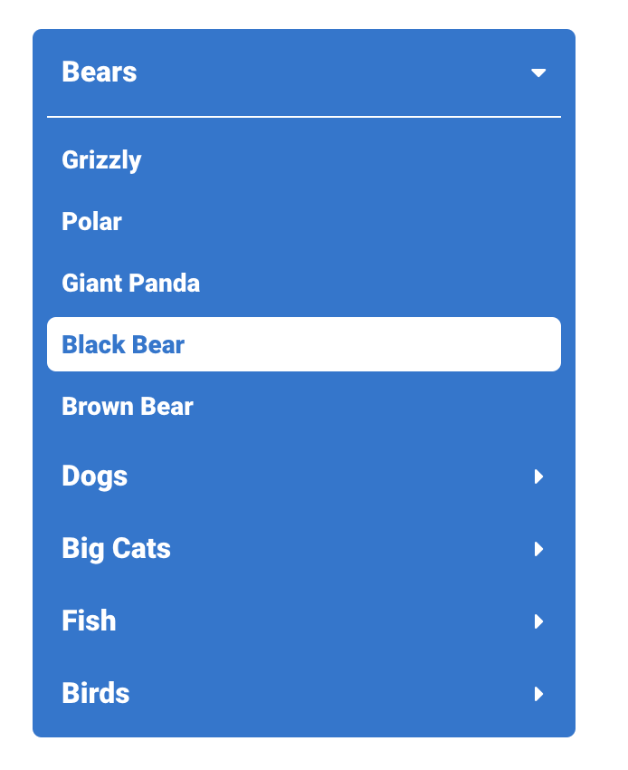
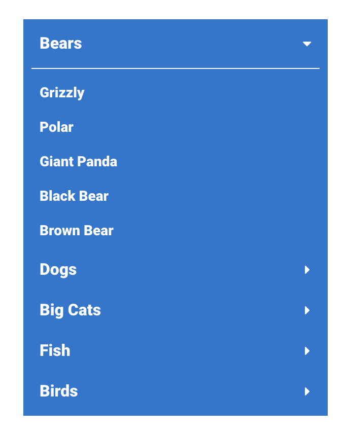
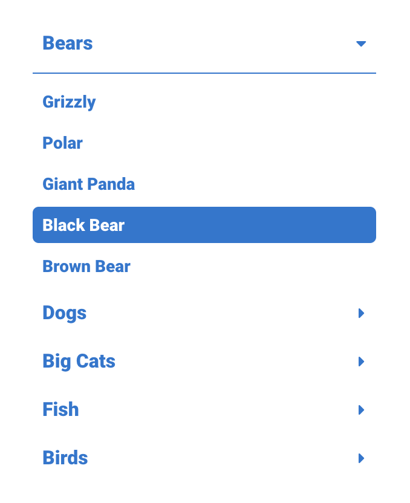

# Accordion Navigation

[](https://www.npmjs.org/package/elr-scss-accordion-nav)
[](https://github.com/Beth3346/elr-scss-accordion-nav/actions/workflows/node.js.yml)
[](https://opensource.org/licenses/MIT)
[](https://npmjs.com/package/elr-scss-accordion-nav)
[](https://github.com/Beth3346/elr-scss-accordion-nav)
[](https://app.netlify.com/sites/elr-accordion-nav/deploys)

a library of sass mixins

## Screenshots

### Default Styles



### Border Radius 0



### Transparent Background



## Installation

Download node at [nodejs.org](http://nodejs.org) and install it, if you haven't already.

```sh
npm install elr-scss-accordion-nav --save
```

or

```sh
yarn install elr-scss-accordion-nav
```

## Implementation

### Scss

```scss
@import "elr-scss-accordion-nav/src/main";

.accordion-nav {
  @include elr-accordion-nav;
}
```

```scss
@import "elr-scss-accordion-nav/src/main";

.accordion-nav-bdrs-0 {
  @include elr-accordion-nav(
    $config: (
      border-radius: 0,
    )
  );
}
```

```scss
@import "elr-scss-accordion-nav/src/main";

.accordion-nav-transparent {
  @include elr-accordion-nav(
    $config: (
      background-color: transparent,
      text-color: #1976d2,
      active-color: transparent,
    )
  );
}
```

### HTML

```html
<nav class="accordion-nav">
  <ul class="elr-accordion-menu">
    <li>
      <button
        data-listid="list-1"
        class="elr-accordion-menu-label js-label active"
      >
        <span>Bears</span>
        <span class="elr-accordion-icon fa fa-caret-down"></span>
      </button>
      <ul id="list-1" class="elr-accordion-menu-inner active">
        <li class="elr-accordion-inner-item">
          <a href="#">Grizzly</a>
        </li>
        <li class="elr-accordion-inner-item">
          <a href="#">Polar</a>
        </li>
        <li class="elr-accordion-inner-item">
          <a href="#">Giant Panda</a>
        </li>
        <li class="elr-accordion-inner-item">
          <a href="#">Black Bear</a>
        </li>
        <li class="elr-accordion-inner-item">
          <a href="#">Brown Bear</a>
        </li>
      </ul>
    </li>
    <li>
      <button data-listid="list-2" class="elr-accordion-menu-label js-label">
        <span>Dogs</span>
        <span class="elr-accordion-icon fa fa-caret-down"></span>
      </button>
      <ul id="list-2" class="elr-accordion-menu-inner">
        <li class="elr-accordion-inner-item">
          <a href="#">Doberman</a>
        </li>
        <li class="elr-accordion-inner-item">
          <a href="#">Shetland Sheepdog</a>
        </li>
        <li class="elr-accordion-inner-item">
          <a href="#">Siberian Husky</a>
        </li>
        <li class="elr-accordion-inner-item">
          <a href="#">Poodle</a>
        </li>
        <li class="elr-accordion-inner-item">
          <a href="#">Scottish Terrier</a>
        </li>
      </ul>
    </li>
    <li>
      <button data-listid="list-3" class="elr-accordion-menu-label js-label">
        <span>Big Cats</span>
        <span class="elr-accordion-icon fa fa-caret-down"></span>
      </button>
      <ul id="list-3" class="elr-accordion-menu-inner">
        <li class="elr-accordion-inner-item">
          <a href="#">Lion</a>
        </li>
        <li class="elr-accordion-inner-item">
          <a href="#">Tiger</a>
        </li>
        <li class="elr-accordion-inner-item">
          <a href="#">Jaguar</a>
        </li>
        <li class="elr-accordion-inner-item">
          <a href="#">Leopard</a>
        </li>
        <li class="elr-accordion-inner-item">
          <a href="#">Panther</a>
        </li>
      </ul>
    </li>
    <li>
      <button data-listid="list-4" class="elr-accordion-menu-label js-label">
        <span>Fish</span>
        <span class="elr-accordion-icon fa fa-caret-down"></span>
      </button>
      <ul id="list-4" class="elr-accordion-menu-inner">
        <li class="elr-accordion-inner-item">
          <a href="#">Clown Fish</a>
        </li>
        <li class="elr-accordion-inner-item">
          <a href="#">Swordfish</a>
        </li>
        <li class="elr-accordion-inner-item">
          <a href="#">Angel Fish</a>
        </li>
        <li class="elr-accordion-inner-item">
          <a href="#">Barracuda</a>
        </li>
        <li class="elr-accordion-inner-item">
          <a href="#">Cod</a>
        </li>
      </ul>
    </li>
    <li>
      <button data-listid="list-5" class="elr-accordion-menu-label js-label">
        <span>Birds</span>
        <span class="elr-accordion-icon fa fa-caret-down"></span>
      </button>
      <ul id="list-5" class="elr-accordion-menu-inner">
        <li class="elr-accordion-inner-item">
          <a href="#">Parrot</a>
        </li>
        <li class="elr-accordion-inner-item">
          <a href="#">Bald Eagle</a>
        </li>
        <li class="elr-accordion-inner-item">
          <a href="#">Hawk</a>
        </li>
        <li class="elr-accordion-inner-item">
          <a href="#">Macaw</a>
        </li>
        <li class="elr-accordion-inner-item">
          <a href="#">Finch</a>
        </li>
      </ul>
    </li>
  </ul>
</nav>
```

## License

SEE LICENSE IN LICENSE.md
